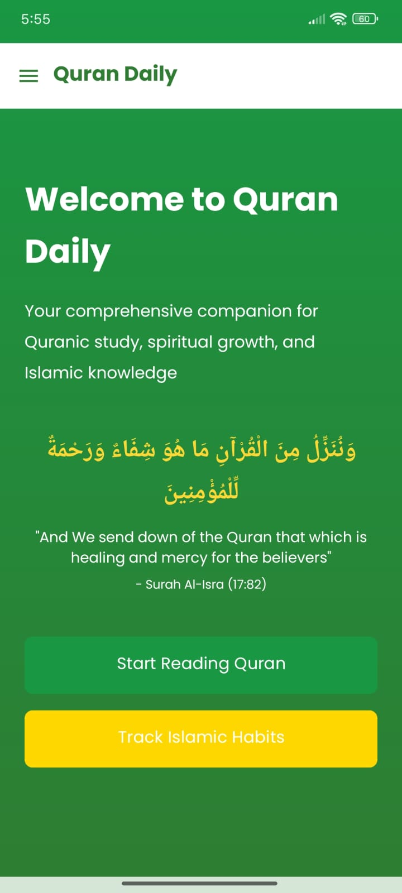
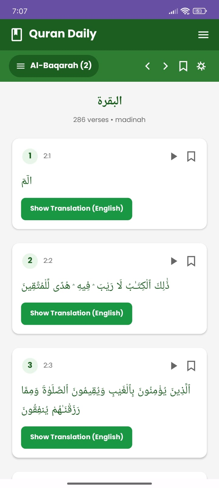
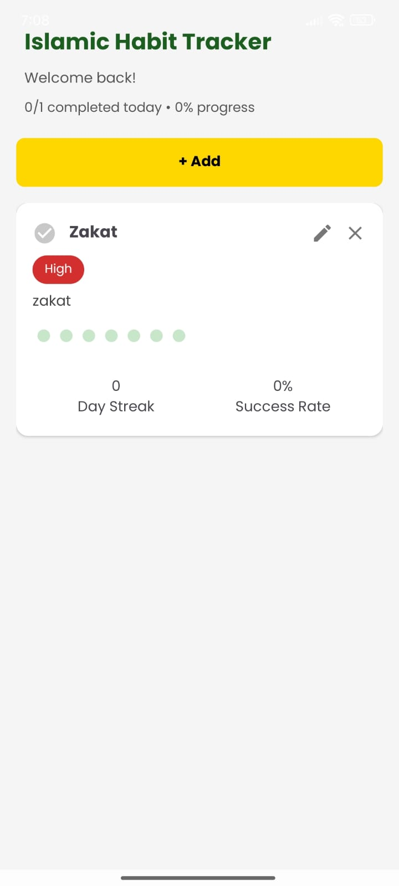

# QuranDaily 📖


**QuranDaily** is a modern Android application designed to help users build a consistent habit of connecting with the Quran. It delivers daily verses, tracks Islamic practices, and provides audio recitations in a clean, responsive interface.

---

## 🌟 Features

* **Daily Verses:** Fetches and displays a new Quranic verse every day using the Quran.com API.
* **Audio Playback:** Listen to high-quality verse recitations directly within the app.
* **Habit Tracker:** A built-in tracker to monitor daily Islamic practices (prayers, reading, dhikr, etc.).
* **User Accounts:** Secure login and registration using **Firebase Authentication**.
* **Cloud Sync:** Syncs user data, bookmarks, and tracking history across devices using **Firebase Realtime Database**.
* **Bookmarking:** Save favorite verses for quick access later.
* **Smart Reminders:** Push notifications to remind users to read their daily verse or complete habit tasks.
* **Optimized Performance:** Designed with a focus on a lightweight footprint and responsive XML layouts.

---

## 🛠 Tech Stack

* **Language:** Kotlin
* **UI/Layout:** XML (ConstraintLayout, RecyclerView)
* **Backend:** Firebase (Authentication, Realtime Database)
* **Networking:** REST APIs (Retrofit/OkHttp)
* **API Provider:** [Quran.com API](https://quran.api-docs.io/)
* **Media:** Android MediaPlayer / ExoPlayer
* **Version Control:** Git

---

## 📱 Screenshots

| Home Screen | Verse Detail | Habit Tracker |
|:---:|:---:|:---:|
|  |  |  |


---

## 🚀 Getting Started

Follow these steps to run the project locally.

### Prerequisites
* Android Studio (Latest version recommended)
* Android SDK
* A Firebase Project

### Installation

1.  **Clone the repository**
    ```bash
    git clone [https://github.com/fahadf-7/QuranDaily.git](https://github.com/fahadf-7/QuranDaily.git)
    ```
2.  **Open in Android Studio**
    * Open Android Studio -> File -> Open -> Select the `QuranDaily` folder.
3.  **Firebase Setup**
    * Go to the [Firebase Console](https://console.firebase.google.com/).
    * Create a new project.
    * Add an Android App to the project (use the package name from `AndroidManifest.xml`).
    * Download the `google-services.json` file.
    * Place `google-services.json` inside the `app/` directory of your project.
    * Enable **Authentication** (Email/Password) and **Realtime Database** in the Firebase Console.
4.  **Build and Run**
    * Sync Gradle files.
    * Connect a device or start an emulator.
    * Click the **Run** button.

---


